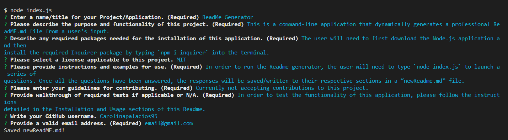

# ReadMe Generator

[](https://opensource.org/licenses/MIT)
    
## Table of Contents
* [Description](#description)
* [User Story](#user-story)
* [Acceptance Criteria](#acceptance-criteria)
* [Demo](#demo)
* [Installation](#installation)
* [Usage](#usage)
* [License](#license)
* [Contributing](#contributing)
* [Tests](#tests)
* [Questions](#questions)

## Description
    
This is a command-line application that dynamically generates a professional ReadME.md file from a user’s input. 

## User Story

```
AS A developer
I WANT a README generator
SO THAT I can quickly create a professional README for a new project
```

## Acceptance Criteria 

```
GIVEN a command-line application that accepts user input
WHEN I am prompted for information about my application repository
THEN a high-quality, professional README.md is generated with the title of my project and sections entitled Description, Table of Contents, Installation, Usage, License, Contributing, Tests, and Questions
WHEN I enter my project title
THEN this is displayed as the title of the README
WHEN I enter a description, installation instructions, usage information, contribution guidelines, and test instructions
THEN this information is added to the sections of the README entitled Description, Installation, Usage, Contributing, and Tests
WHEN I choose a license for my application from a list of options
THEN a badge for that license is added near the top of the README and a notice is added to the section of the README entitled License that explains which license the application is covered under
WHEN I enter my GitHub username
THEN this is added to the section of the README entitled Questions, with a link to my GitHub profile
WHEN I enter my email address
THEN this is added to the section of the README entitled Questions, with instructions on how to reach me with additional questions
WHEN I click on the links in the Table of Contents
THEN I am taken to the corresponding section of the README
```

## Demo

The following link includes a video demo of the application's functionality:

[Readme Generator Video Demo](https://drive.google.com/file/d/1HXXeUUkBHbR1Q9FAY7wB2Ewc5ozJjaY4/view)

The following image demonstrates a mock-up example of what a user would view in the terminal when using this application.



## Installation

The user will need to first download the Node.js application and then install the required Inquirer package by typing `npm i inquirer` into the terminal.

## Usage

In order to run the Readme generator, the user will need to type `node index.js` to launch a series of questions. Once all the questions have been answered, the responses will be saved/written to their respective sections in a “newReadme.md” file.

## License
        
    MIT

## Contributing

Currently not accepting contributions to this project.

## Tests

In order to test the functionality of this application, please follow the instructions detailed in the Installation and Usage sections of this Readme.

## Questions

If there are additional questions, please reach out to me here: 

* GitHub: https://github.com/Carolinapalacios95
* Email: carolina.palacios1995@gmail.com
